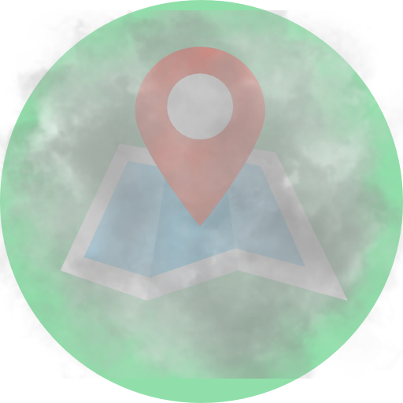

# Explorer App 🌍

The official mobile companion for [Explorer](https://github.com/colinLi33/explorer). Built with **React Native** and **Expo**, this app allows you to track your location in the background, sync your travel history, and view your personal Fog of War map on the go.

  

## ✨ Features

- **Background Location Tracking**: Efficiently tracks your location even when the app is closed, using motion detection to save battery.
- **Offline Sync**: Caches location data when offline and automatically syncs to the server when connection is restored.
- **Interactive Map**: View your personal Fog of War map directly in the app.

## 🛠️ Tech Stack

- **Framework**: React Native (Expo)
- **Maps**: React Native Webview (CesiumJS via Website)
- **Tracking**: `react-native-background-geolocation`